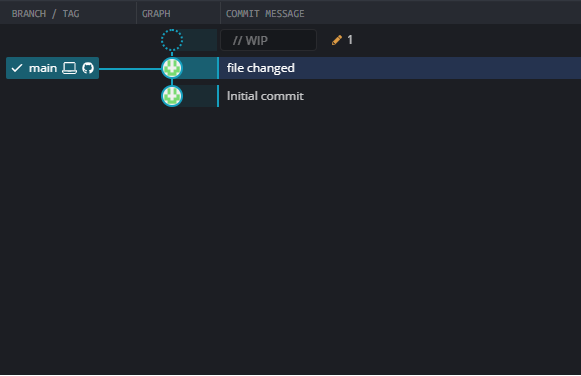

# intern

## 1. git

 - git command
 
```
 git clone https://github.com/Kimmuchii/inter.git
 git status
 git branch 
 git branch -a
 git reset
 git push
 git pull
 git checkout
```

```bash
import os
pirint("test")
```

## 2. gitkraken



 - license : student licent can be used for free
 - free version can access only public repo.
 - licensed version can access private too.
 - term :
    a. staged
    b. stash

```
term

```


## 3. Visual Studio Code
- how to preview some codes
```
comand k + v
```
- 


## Terminal 
#### 4. How to Activate Venv and Set python Version
 - how to download, use, and  a python version
```
brew install python@3.9

python3.9 -m venv version3.9

Source version3.9/bin/activate
```
- using that we can also download numpy or other mods matching that version
```
python3.9 -m pip install numpy
```
- to check the downloaded things on pip
```
pip list
```

#### code
- current to parent folder
```
cd ..
```

- to make new directory
```
mkdir _______
sudo mkdir _______
```
- then with that made directory we can start coding
```
cd pythoncode
```