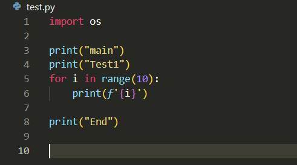
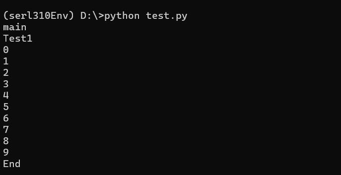

## Python

#### 1.virtual environment

- in macos, type following command for creating virtual environment in current folder
```bash
python3.9 -m venv <virtualenvironment name>

ex) 
   python3.9 -m venv python39Env
   python3.12 -m venv python312Env
   python3.9 -m venv tsst39Env
   python3.9 -m venv llm39Env 
```


#### 2. activate virtual environment

- Virtual Enviornment can be activate after creating virtual environment
- In each virtual environment folder, they have activate file.
- Activate file has activate command inside. so, we are running activate file using source command
- The location of activate is in the following folder
```bash
<virtual environment>/bin/activate     <- this is file 
ex) python39Env/bin/activate
```
- Folowing command activate virtual environment you want
``` bash
source <virtual environment>/bin/activate
ex) source python39Env/bin/activate
    source python312Env/bin/activate
    source test39Env/bin/activate
    source llm39Env/bin/activate
```
- After activation, type following python3 will display virtual environment python version
```bash
python3
```
- Following command install python module, library(After activate)
```bash
pip install stable-baselines3[extra]
pip install numpy
pip install matplotlib
```

- Following command deactive virtual environment(After activate).
``` bash
deactivate
```

#### 3. How to run python code.

- For example, test.py is the test python code to test




- After activate virtual environment, it can run python file with the following command.
  (test.py is in the same folder)
```bash
python3 test.py
```



