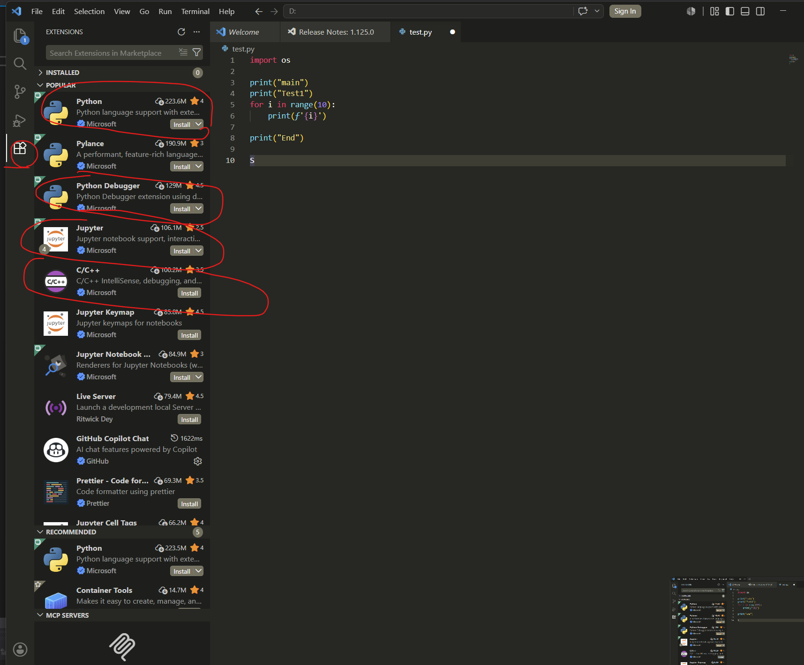
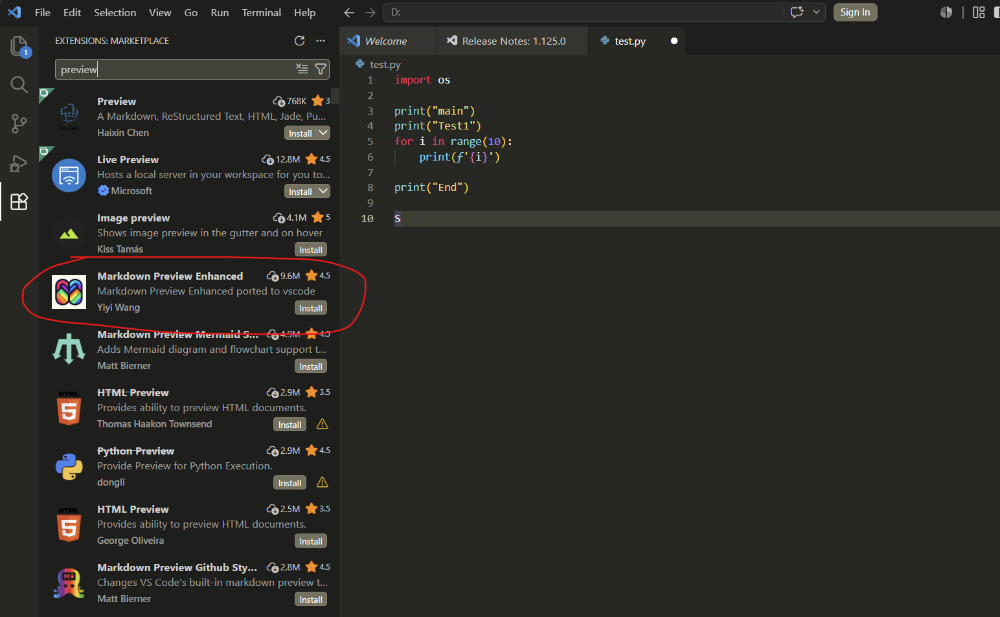
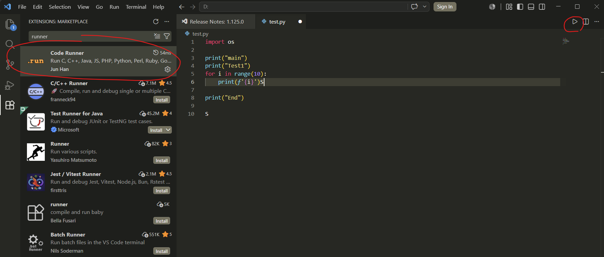
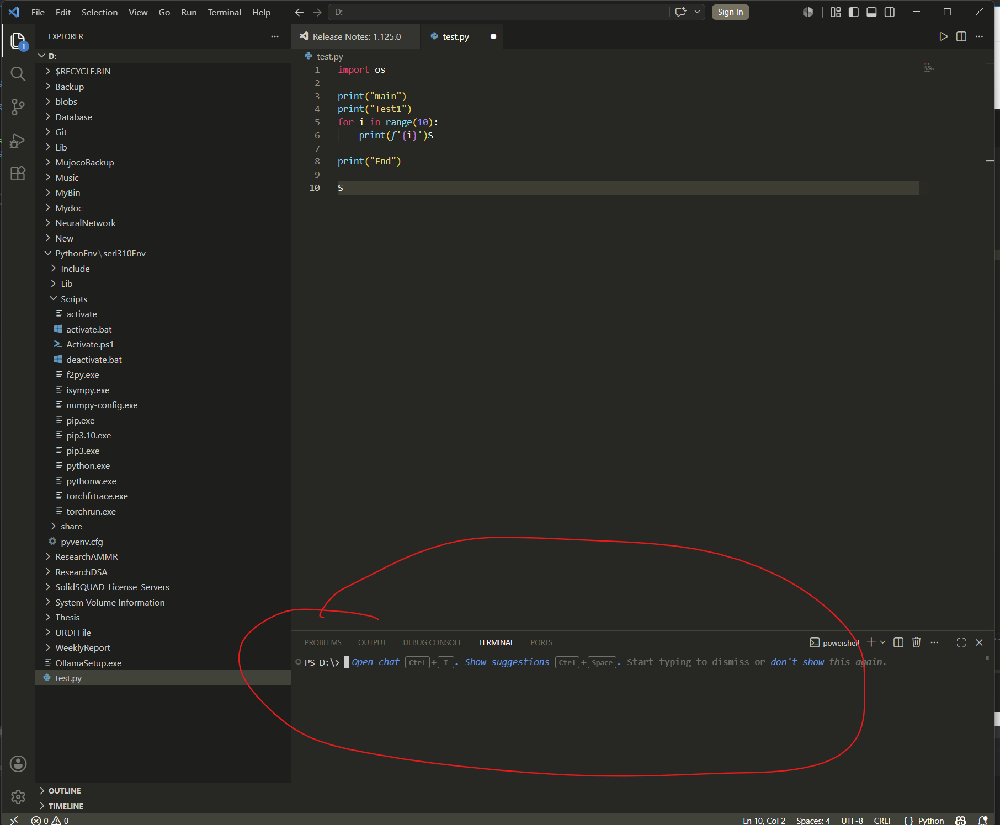
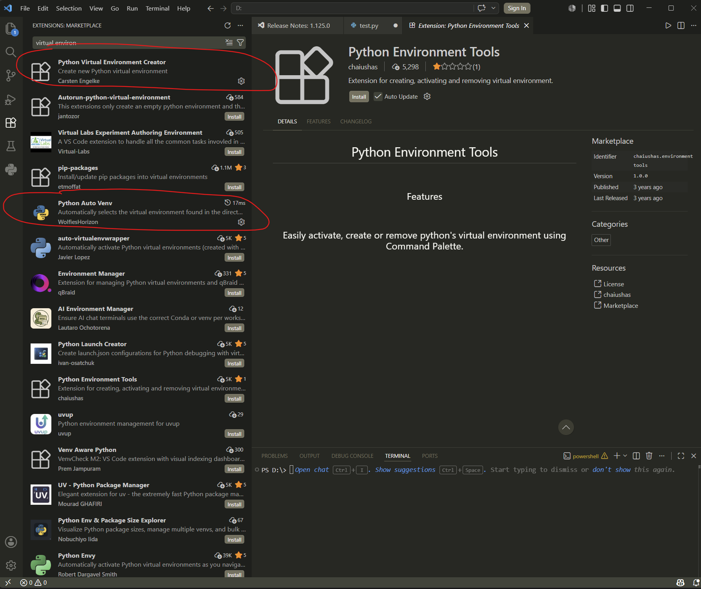
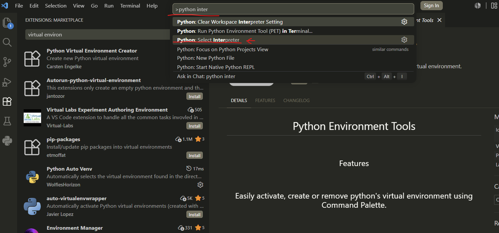

## Visual Studio Code

#### 1. Install extension

- install following extension

- Code runner
  This extension can run python code in visual studio code

- How to open terminal
  call pallette(command + shift + `) will open terminal
 

- Install python extension too

- How to enable virtual environment in visual studio code

